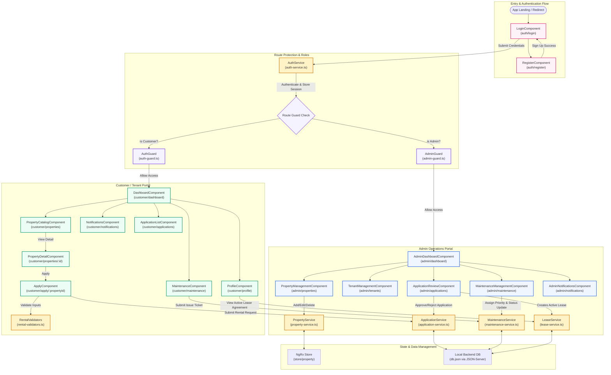

# Property Rental & Tenant Management Portal

Welcome to the **Property Rental & Tenant Management Portal**—a state-of-the-art Angular web application designed to simplify the rental process for tenants and streamline property operations for landlords/administrators. Built with a modern vanilla design system, clean flat architecture, and robust state management.

---

## 🚀 Complete Project Workflow & Component Architecture

Below is the end-to-end component flow and system architecture, illustrating routing, services, role separation, and local database integration.



---

## ✨ Key Features

### 🔑 Authentication & Access Control
- **Dynamic Roles**: Support for `customer` and `admin` portals.
- **Route Guards**: Unauthorized routes are automatically protected using `AuthGuard` and `AdminGuard`.
- **Preconfigured Credentials**: Dedicated buttons on the login screen to quickly autofill demo users:
  - **Admin**: `admin@rental.com` / `admin123`
  - **Customer**: `rahul@gmail.com` / `rahul123`

### 👤 Customer Features
- **Dashboard**: Track rental application updates, rent cycles, lease status, and active tickets.
- **Property Catalog**: Browse properties with dynamic hover highlighting using a custom `HighlightDirective`. Filter by bedrooms, rent, types, and furnishing configurations.
- **Rental Applications**: Submit detailed rental requests with validation (Income checks, lease terms, custom validator constraints).
- **Maintenance Desk**: Raise, track, and monitor maintenance tickets (Category: Plumbing, Electrical, Cleaning, Appliance, Structural) and view update logs.
- **Profile / Active Lease**: Edit contact parameters and review current active lease terms (Start Date, End Date, Rent Amount).

### 🛠️ Admin Features
- **Overview Dashboard**: Graphical and tabular metrics representing system health (total property units, leases, pending complaints, applications).
- **Property Portfolio Management**: Full CRUD controls to add, inspect, modify, or archive rental units.
- **Application Review Panel**: Review tenant income profiles, check tenant requests, and either Approve or Reject applications.
- **Tenant Registry**: Review verified tenant contacts, active rentals, and associated phone and email addresses.
- **Maintenance Center**: Review tenant tickets, select urgent concerns (Low/Medium/High), and track/update issues from "New" to "In Progress" or "Resolved".

---

## 🛠️ Technology Stack

- **Framework**: Angular v21 (Standalone components)
- **State Management**: NgRx Store, Effects, and Entity selectors
- **Styling**: Premium Vanilla CSS (custom design system tokens using HSL/RGB, smooth micro-animations, flat layout class structures)
- **Mock Database**: JSON Server (watching local `db.json`)
- **Testing**: Vitest for unit validation

---

## 📂 Project Architecture

```bash
src/app/
├── core/                        # Core Singletons, Guards & Models
│   ├── guards/                  # Route activation guards (auth-guard.ts, admin-guard.ts)
│   ├── models/                  # TypeScript interface definitions (user, property, lease, etc.)
│   └── services/                # Core HTTP & data handlers (auth, property, application, lease, etc.)
├── features/                    # Feature Modules
│   ├── admin/                   # Admin pages (dashboard, applications, properties, maintenance, tenants)
│   ├── auth/                    # Login and Registration components
│   └── customer/                # Tenant pages (dashboard, catalog, apply, maintenance, profile)
├── shared/                      # Reusable Layout, Pipes & Directives
│   ├── components/              # Shared UI components (navbar, footer, property-card, status-badge)
│   ├── directives/              # Custom attribute selectors (appHighlight, roleAccess)
│   ├── pipes/                   # Pure value pipes (rentFormat, statusLabel)
│   └── validators/              # Custom Angular form validators (rental-validators.ts)
└── store/                       # NgRx Global Store modules (property state management)
```

---

## ⚙️ Setup & Installation

Follow these steps to set up and run the application locally:

### 1. Clone & Install Dependencies
Ensure you have [Node.js](https://nodejs.org/) installed, then run:
```bash
npm install
```

### 2. Start the Backend API (JSON-Server)
The project relies on a mock JSON backend server. Start it with:
```bash
npm run backend
```
*This starts a local API server listening on `http://localhost:3000` and watches `db.json` for modifications.*

### 3. Start the Angular Dev Server
In a new terminal workspace, launch the Angular application:
```bash
npm start
```
*The application will boot and serve locally on `http://localhost:4200/`. The browser will hot-reload on file edits.*

### 4. Build for Production
To compile production-ready assets and verify bundle integrity:
```bash
npm run build
```
*Assets are generated inside the `dist/` directory, optimized for maximum speed.*

### 5. Running Tests
Verify component and service behavior:
```bash
npm run test
```
